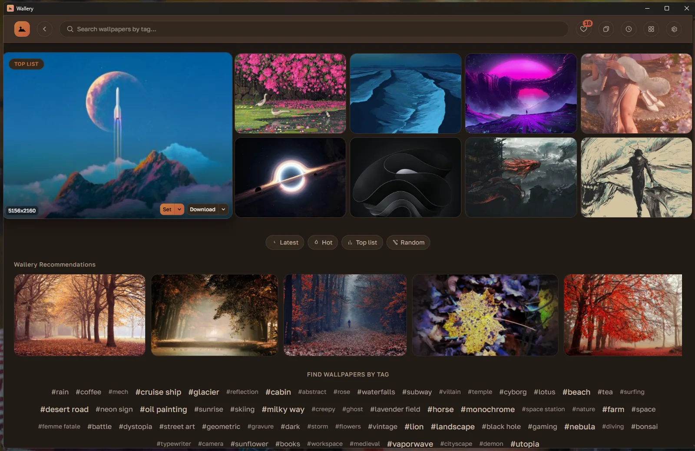
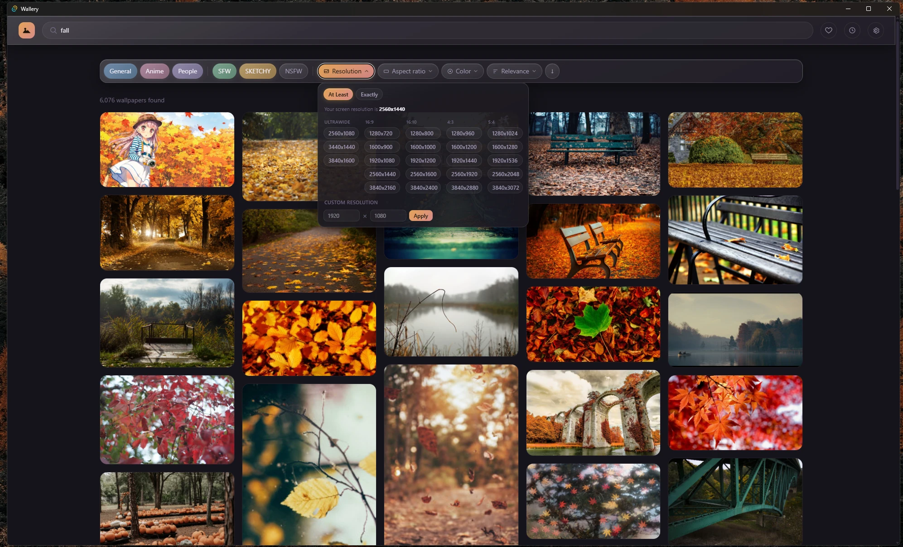
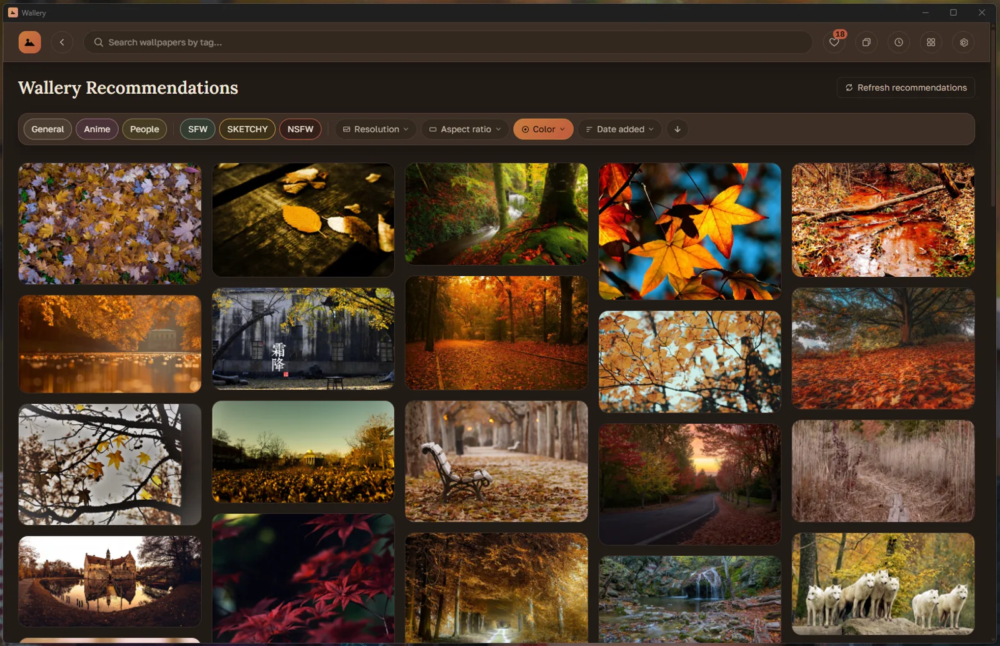
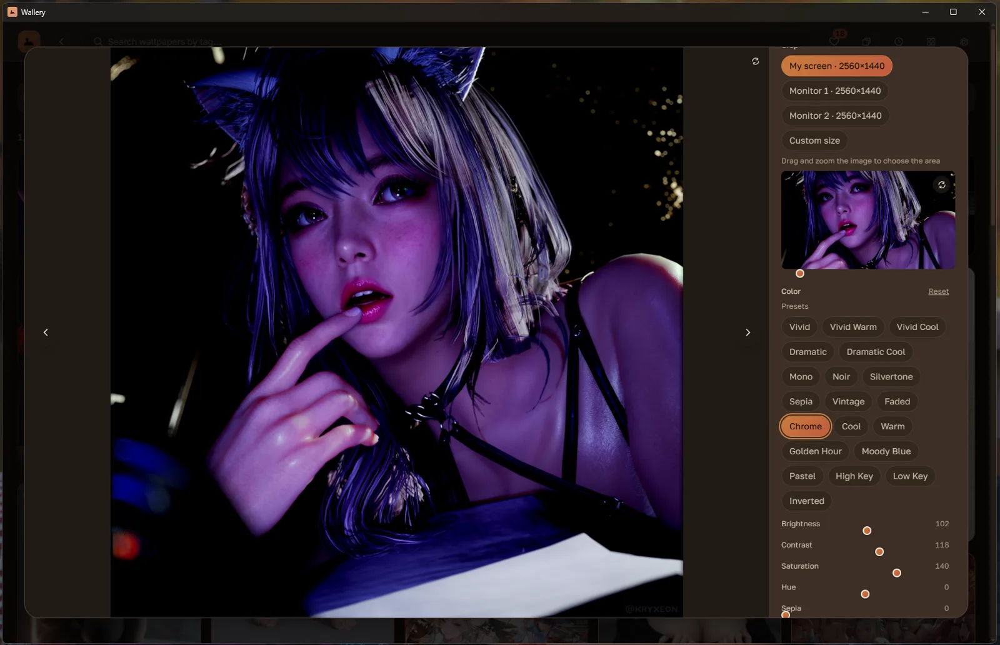
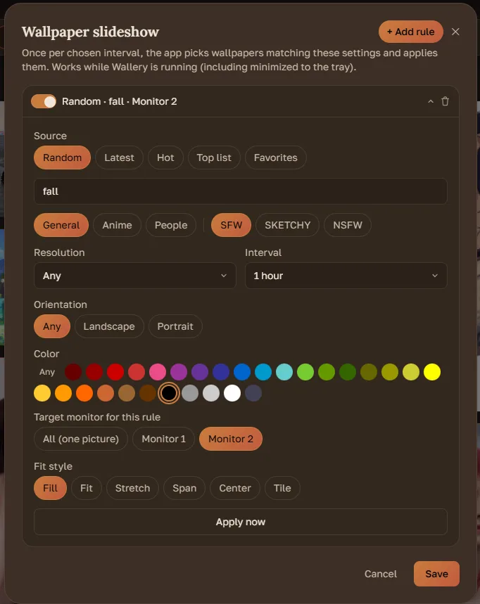
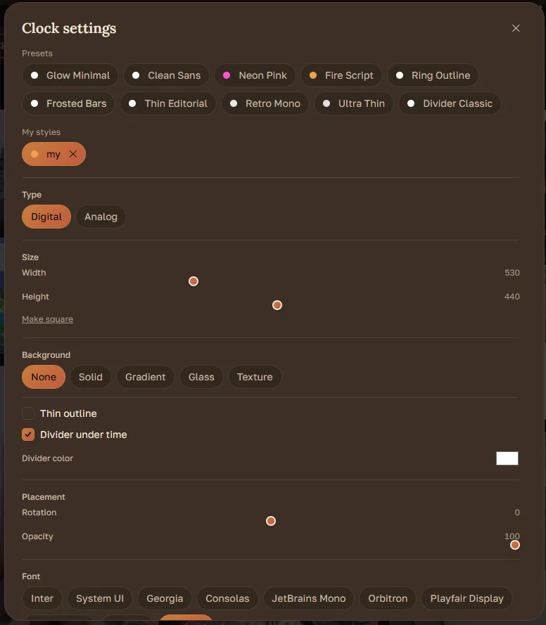
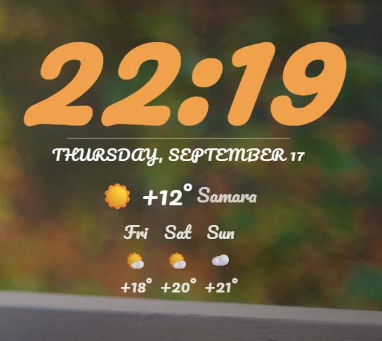

# Wallery

[](https://github.com/dmitrykirsh/wallery/releases/latest)
[](https://github.com/dmitrykirsh/wallery/releases)
[](LICENSE)
[](https://github.com/dmitrykirsh/wallery)

A fast, modern desktop wallpaper browser for [Wallhaven](https://wallhaven.cc), built with Tauri + React. Browse, filter, crop, and automatically rotate wallpapers — without ever leaving a native desktop app.

## Features

### Browse & get recommendations

A rotating hero banner (Hot / Top list / Latest / your own custom tags) and a personalized "Recommended for you" row based on your favorites and search history, plus an endless feed of wallpapers grouped by tag.



### Search like on Wallhaven itself

The same resolution, aspect ratio, color, and sorting filters as the original site — including "At least" / "Exactly" resolution matching and grouped aspect ratios.




### Crop to your exact screen

Open any wallpaper, pick your monitor's resolution (auto-detected) or a custom size, pan and zoom to frame it, then save the crop or set it as your wallpaper directly.



### Automatic wallpaper slideshow

Set up rules — by tag, source, resolution, color, orientation — and Wallery rotates your wallpaper on a schedule, even per monitor, while running quietly in the tray.



### Desktop clock widgets

Add a clock straight onto your desktop — draggable, resizable, and sitting behind your other windows. 10 built-in presets or a full editor (fonts, colors, glass backgrounds, outline, divider, rotation, opacity, analog or digital), plus live date and weather with a 3-day forecast, per-monitor placement, and exporting a style to share with others.

<table>
  <tr>
    <td></td>
    <td></td>
  </tr>
</table>

Also included: favorites, view history, a photo editor with crop and color adjustments, smarter recommendations that adapt to your feedback, search history, a multi-language UI (RU / EN / ES / FR / DE / ZH), launch-on-startup, and a system tray icon that keeps the slideshow running when the window is closed.

## Download

Grab the latest Windows installer from [Releases](../../releases) (`.exe` or `.msi`).

> Wallery talks to the [Wallhaven API](https://wallhaven.cc/api/v1). You'll need a free Wallhaven account and an API key (Settings → wallhaven.cc/settings/account) to see NSFW-flagged results.

## Building from source

```bash
npm install
npm run tauri dev    # run in dev mode
npm run tauri build  # build a release installer
```

Requires Node.js and the Rust toolchain — see the [Tauri prerequisites](https://tauri.app/start/prerequisites/).

Windows only for now — wallpaper-setting, monitor detection, and autostart all go through Windows-specific APIs.

## Tech

Tauri 2 (Rust) + React + TypeScript + Tailwind CSS, talking to the Wallhaven API.

## License

[MIT](LICENSE)

---

Not affiliated with Wallhaven — just a desktop client for its public API.
